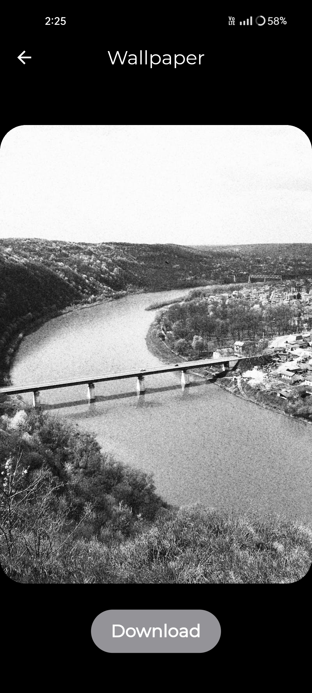
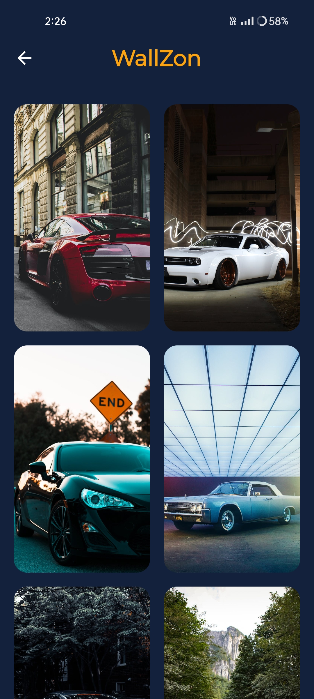

# WallZon - A Flutter Wallpaper App

WallZon is a beautiful and easy-to-use wallpaper application built with Flutter, using the Pexels API to fetch high-quality wallpapers.

## Features

- Browse through a vast selection of high-quality wallpapers.
- Search for specific wallpapers based on keywords.
- Download your favorite wallpapers.

## Installation

To run the app, follow these simple steps:

1. Clone this repository to your local machine.
2. Install all dependencies by running `flutter pub get`.
3. Obtain an API key from [Pexels.com](https://www.pexels.com/api/), then create a `.env` file at the root of the project and add your API key as `API_KEY=your_api_key_here`.
4. Run the app using `flutter run`.

## Screenshots

### Home Screen

![Home Screen] (screenshots/home.jpg)

### Wallpaper Detail Screen

### Search Screen

## Technologies Used

- Flutter
- Pexels API

## Contributions

Contributions are always welcome! If you find any bugs or have suggestions for new features, please feel free to submit an issue or a pull request.

## License

This project is licensed under the [MIT License](LICENSE).